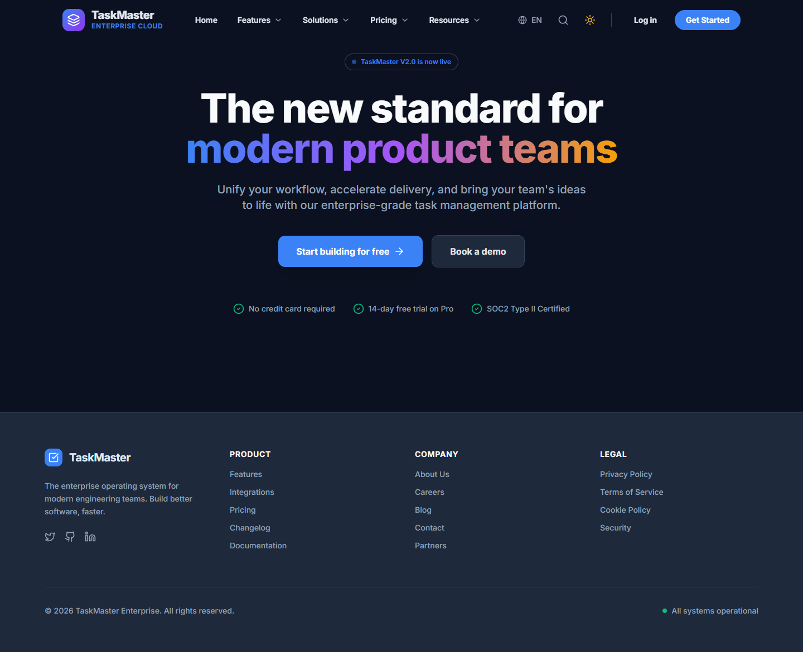
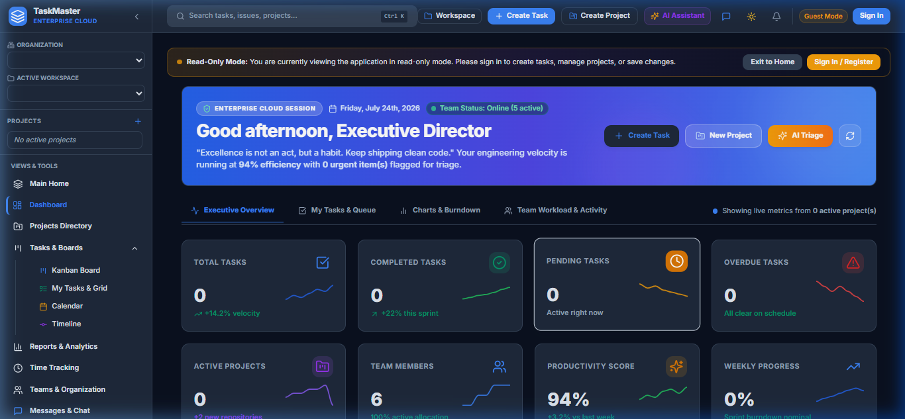
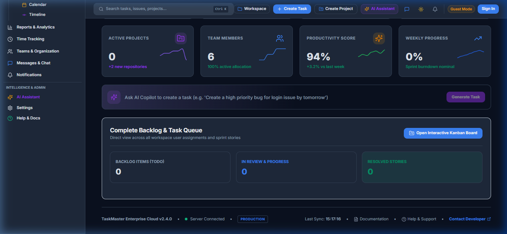
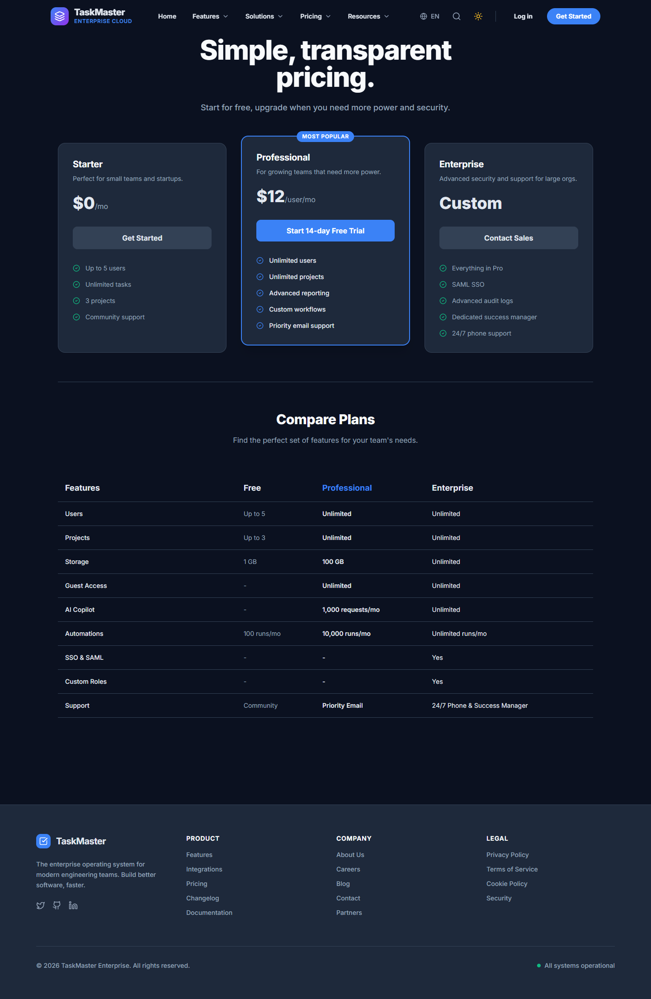
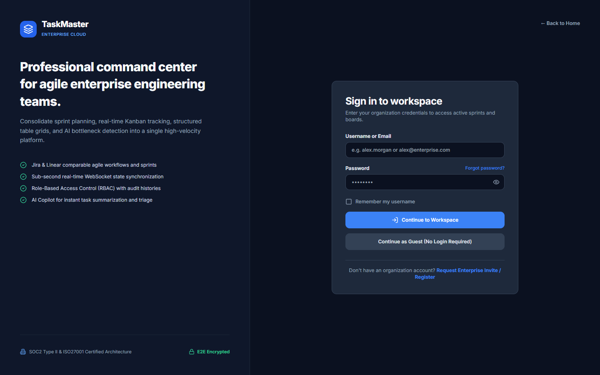
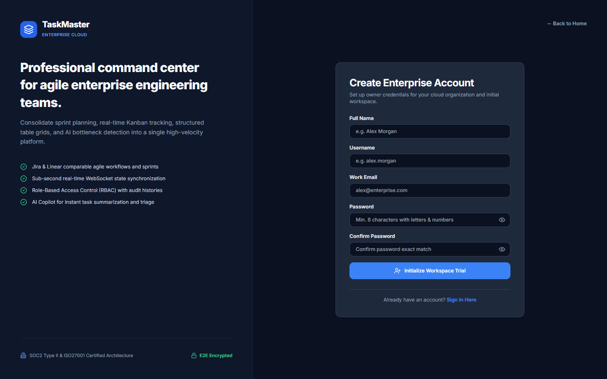



  
  <h1>TaskMaster - Enterprise SaaS Task Management Platform</h1>
  
  
<strong>A full-stack, enterprise-grade task and project management application inspired by Jira, ClickUp, and Asana.</strong>

  

    
    
  

  

    
    
    
    
    
  

---

## 📖 Table of Contents
- [Overview](#-overview)
- [Key Features](#-key-features)
- [Screenshots](#-screenshots)
- [Tech Stack](#-tech-stack)
- [Local Development Setup](#-local-development-setup)
- [Live Deployments](#-live-deployments)

---

## 🚀 Overview

**TaskMaster** is an advanced Task & Project Management SaaS platform designed to boost team productivity and streamline workflow management. Built for scale, it utilizes cutting edge asynchronous python with FastAPI, real-time websockets, and a beautiful React front-end.

> *Empower your teams to stay organized, collaborate in real-time, and deliver faster with TaskMaster.*

---

## ✨ Key Features

| Feature | Description |
|---------|-------------|
| ⚡ **Dynamic Kanban Board** | Drag-and-drop task management across customizable columns with instant persistence. |
| 🔄 **Real-time Synchronization** | WebSockets ensure instant updates across all connected clients without page reloads. |
| 🔐 **Secure Authentication** | Robust JWT-based authentication and secure session management. |
| 🎨 **Enterprise-Grade UI** | Built with React, Tailwind CSS, and Framer Motion for premium aesthetics. |
| 📋 **Project & Task Management** | Detailed task views, labels, priorities, assignments, and due dates. |
| 🤖 **AI Integration** | AI-powered task summarization and suggestions via Google Generative AI (Gemini). |

---

## 📸 Screenshots

<b>Click to expand and view application screenshots</b>

 

### 1. Landing Page
*The marketing homepage showcasing the value proposition of TaskMaster.*

### 2. Dashboard
*An overview of your projects, tasks, and recent activity.*

### 3. Kanban Board
*The interactive drag-and-drop Kanban board for managing task workflows.*

### 4. Pricing & Plans
*Flexible SaaS subscription tiers.*

### 5. Authentication
*Secure login and registration flows.*

  
  

---

## 🛠️ Tech Stack

  <table>
    <tr>
      <td align="center" width="50%">
        <h3>🎨 Frontend</h3>
        <b>Framework:</b> React 18 (Vite) 
        <b>Language:</b> TypeScript 
        <b>Styling:</b> Tailwind CSS, Framer Motion 
        <b>State Management:</b> Zustand, React Query 
        <b>Routing:</b> React Router DOM v6 
        <b>Real-time:</b> Socket.IO-Client
      </td>
      <td align="center" width="50%">
        <h3>⚙️ Backend</h3>
        <b>Framework:</b> FastAPI (Python 3.11+) 
        <b>Database:</b> MongoDB (Motor / Beanie ODM) 
        <b>Authentication:</b> JWT, Passlib, bcrypt 
        <b>Real-time:</b> python-socketio 
        <b>AI Integration:</b> Google Generative AI (Gemini) 
        <b>Task Queue:</b> Celery + Redis
      </td>
    </tr>
  </table>

---

## ⚙️ Local Development Setup

### 1. Prerequisites
- Node.js (v18+)
- Python (v3.11+)
- MongoDB Atlas URL or Local MongoDB
- Redis (for background tasks & WebSockets)

### 2. Backend Setup
\\\ash
cd backend
python -m venv venv
# Windows: venv\Scripts\activate | Mac/Linux: source venv/bin/activate

pip install -r requirements.txt

# Create a .env file with your configurations
# MONGODB_URI=your_mongo_url
# SECRET_KEY=your_secret_key

uvicorn app.main:app --reload --port 8001
\\\

### 3. Frontend Setup
\\\ash
cd frontend
npm install

# Set your API URL in .env
# VITE_API_URL=http://localhost:8001/api/v1

npm run dev
\\\

---

## 🌍 Live Deployments

- **Frontend (Vercel)**: [https://taskmaster-tm.vercel.app](https://taskmaster-tm.vercel.app)
- **Backend (Render)**: [https://taskmaster-z52i.onrender.com](https://taskmaster-z52i.onrender.com)

---

  <b>Built with ❤️ by DINESH KUMAR YADAV</b> 
  <i>Enterprise SaaS Task Management Platform</i>

