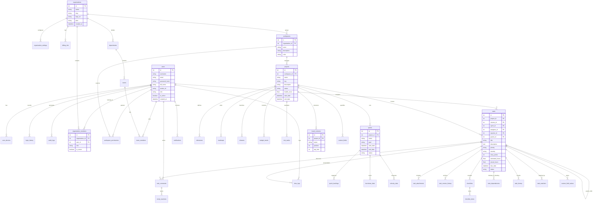

# Entity-Relationship Diagram (ERD)

Below is the complete database ER diagram for the Enterprise SaaS Task Management Platform.

```mermaid
erDiagram
    users ||--o{ user_devices : has
    users ||--o{ login_history : records
    users ||--o{ audit_logs : generates
    users ||--o{ organization_members : belongs_to
    users ||--o{ workspace_permissions : granted
    users ||--o{ team_members : joins
    users ||--o{ tasks : assigned
    users ||--o{ task_comments : writes
    users ||--o{ time_logs : logs
    users ||--o{ notifications : receives

    organizations ||--o{ organization_members : contains
    organizations ||--o{ organization_settings : configures
    organizations ||--o{ billing_info : has
    organizations ||--o{ workspaces : groups
    organizations ||--o{ departments : divides

    departments ||--o{ teams : contains
    teams ||--o{ team_members : has

    workspaces ||--o{ workspace_permissions : restricts
    workspaces ||--o{ projects : manages

    projects ||--o{ milestones : defines
    projects ||--o{ roadmaps : plots
    projects ||--o{ releases : launches
    projects ||--o{ budget_tracks : monitors
    projects ||--o{ risk_tracks : evaluates
    projects ||--o{ sprints : runs
    projects ||--o{ board_columns : structures
    projects ||--o{ tasks : houses
    projects ||--o{ custom_fields : specifies

    sprints ||--o{ sprint_backlogs : organizes
    sprints ||--o{ burndown_data : tracks
    sprints ||--o{ velocity_data : measures

    tasks ||--o{ task_attachments : includes
    tasks ||--o{ task_version_history : archives
    tasks ||--o{ checklists : contains
    tasks ||--o{ task_dependencies : blocked_or_blocking
    tasks ||--o{ task_comments : discusses
    tasks ||--o{ task_history : records
    tasks ||--o{ task_watchers : watched_by
    tasks ||--o{ time_logs : accumulated
    tasks ||--o{ custom_field_values : stores
    tasks ||--o| tasks : parent_child

    checklists ||--o{ checklist_items : items
    task_comments ||--o{ emoji_reactions : reacts

    users {
        int id PK
        string username
        string email
        string password_hash
        string full_name
        string avatar_url
        string role
        boolean is_active
        datetime created_at
    }

    organizations {
        int id PK
        string name
        string slug
        string logo_url
        string plan
        datetime created_at
    }

    organization_members {
        int id PK
        int organization_id FK
        int user_id FK
        string role
        boolean is_owner
    }

    workspaces {
        int id PK
        int organization_id FK
        string name
        string description
        string color
    }

    projects {
        int id PK
        int workspace_id FK
        string name
        string key
        string description
        string status
        float health_score
        datetime start_date
        datetime end_date
    }

    sprints {
        int id PK
        int project_id FK
        string name
        string goal
        datetime start_date
        datetime end_date
        string status
    }

    board_columns {
        int id PK
        int project_id FK
        string name
        int position
        int wip_limit
    }

    tasks {
        int id PK
        int project_id FK
        int column_id FK
        int sprint_id FK
        int assignee_id FK
        int reporter_id FK
        int parent_id FK
        string title
        text description
        string priority
        string severity
        int story_points
        float estimated_hours
        float actual_hours
        datetime due_date
        string status
    }
```
